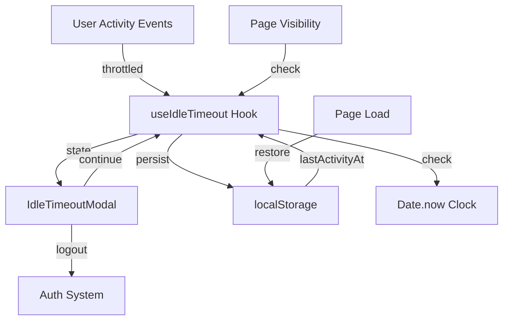
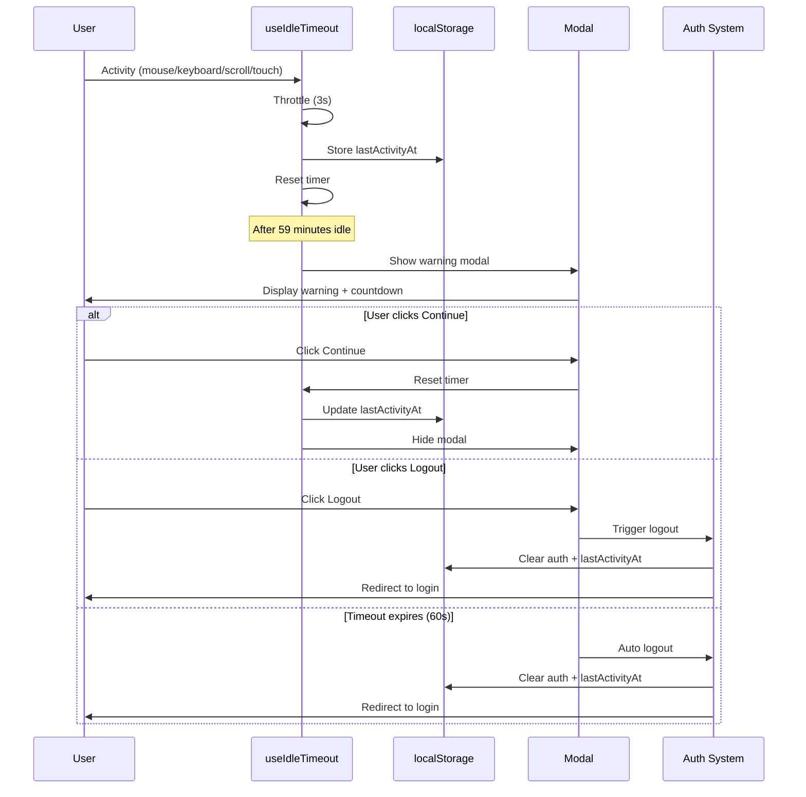

# Design Document - Idle Session Timeout

## Overview

This feature implements a client-side idle session timeout mechanism for a React + Vite + TypeScript application. The design prioritizes code quality, maintainability, and bug prevention through:

- **Single Responsibility**: Each component has one clear purpose
- **Type Safety**: Full TypeScript coverage with strict types
- **Testability**: Pure functions and isolated side effects
- **Resource Efficiency**: Throttled event handling and cleanup
- **State Consistency**: Single source of truth using Date.now()
- **Error Prevention**: Defensive programming and edge case handling

The implementation consists of three main components:
1. **useIdleTimeout Hook**: Core logic for idle detection and timer management
2. **IdleTimeoutModal Component**: UI for warning and user actions
3. **Integration Layer**: Connection to authentication system

## Architecture

### High-Level Architecture



### Component Interaction Flow



## Components and Interfaces

### 1. useIdleTimeout Hook

**Purpose**: Manage idle detection, timer state, and modal visibility.

**Interface**:

```typescript
interface UseIdleTimeoutOptions {
  idleMs: number;              // Total idle time before logout (default: 60 * 60 * 1000)
  warnMs: number;              // Warning duration before logout (default: 60 * 1000)
  throttleMs: number;          // Throttle interval for activity updates (default: 3000)
  isAuthenticated: boolean;    // Whether user is logged in
  onLogout: () => void;        // Callback to perform logout
}

interface UseIdleTimeoutReturn {
  showModal: boolean;          // Whether to show warning modal
  remainingSeconds: number;    // Countdown seconds in modal
  handleContinue: () => void;  // Handler for continue button
  handleLogout: () => void;    // Handler for logout button
}

function useIdleTimeout(options: UseIdleTimeoutOptions): UseIdleTimeoutReturn;
```

**Key Responsibilities**:
- Track user activity events (mouse, keyboard, scroll, touch)
- Throttle activity updates to reduce resource usage
- Persist lastActivityAt to localStorage
- Calculate idle duration using Date.now()
- Show modal when idle threshold is reached
- Handle page visibility changes
- Restore state on page load
- Clean up event listeners on unmount

**Implementation Strategy**:

```typescript
// Core state management
const [showModal, setShowModal] = useState(false);
const [remainingSeconds, setRemainingSeconds] = useState(warnMs / 1000);

// Refs to avoid stale closures
const lastActivityRef = useRef<number>(Date.now());
const checkIntervalRef = useRef<ReturnType<typeof window.setInterval> | null>(null);
const countdownIntervalRef = useRef<ReturnType<typeof window.setInterval> | null>(null);
const isModalOpenRef = useRef<boolean>(false);

// Throttled activity handler
const handleActivity = useCallback(
  throttle(() => {
    if (isModalOpenRef.current) return; // Ignore activity during modal
    
    const now = Date.now();
    lastActivityRef.current = now;
    localStorage.setItem('lastActivityAt', String(now));
  }, throttleMs),
  [throttleMs]
);

// Check idle status
const checkIdleStatus = useCallback(() => {
  const now = Date.now();
  const lastActivity = lastActivityRef.current;
  const idleDuration = now - lastActivity;
  
  if (idleDuration >= idleMs) {
    // Auto logout after full idle period
    performLogout();
  } else if (idleDuration >= idleMs - warnMs && !isModalOpenRef.current) {
    // Show warning before logout (e.g., at 59 minutes for 60min idle, 1min warn)
    setShowModal(true);
    isModalOpenRef.current = true;
    startCountdown();
  }
}, [idleMs, warnMs]);

// Handle page visibility
const handleVisibilityChange = useCallback(() => {
  if (document.visibilityState === 'visible') {
    checkIdleStatus();
  }
}, [checkIdleStatus]);
```

### 2. IdleTimeoutModal Component

**Purpose**: Display warning message and action buttons.

**Interface**:

```typescript
interface IdleTimeoutModalProps {
  isOpen: boolean;
  remainingSeconds: number;
  onContinue: () => void;
  onLogout: () => void;
}

function IdleTimeoutModal(props: IdleTimeoutModalProps): JSX.Element;
```

**Key Responsibilities**:
- Render modal overlay and content
- Display countdown timer
- Provide Continue and Logout buttons
- Prevent multiple modals (controlled by isOpen prop)
- Accessible keyboard navigation (Escape key, focus trap)

**Implementation Strategy**:

```typescript
const IdleTimeoutModal: React.FC<IdleTimeoutModalProps> = ({
  isOpen,
  remainingSeconds,
  onContinue,
  onLogout,
}) => {
  // Prevent rendering if not open
  if (!isOpen) return null;

  // Handle escape key
  useEffect(() => {
    const handleEscape = (e: KeyboardEvent) => {
      if (e.key === 'Escape') onContinue();
    };
    
    document.addEventListener('keydown', handleEscape);
    return () => document.removeEventListener('keydown', handleEscape);
  }, [onContinue]);

  return (
    <div className="modal-overlay" role="dialog" aria-modal="true">
      <div className="modal-content">
        <h2>تحذير انتهاء الجلسة</h2>
        <p>ستنتهي الجلسة خلال {remainingSeconds} ثانية. هل تريد الاستمرار؟</p>
        <div className="modal-actions">
          <button onClick={onContinue} autoFocus>
            استمرار
          </button>
          <button onClick={onLogout}>
            إنهاء الجلسة
          </button>
        </div>
      </div>
    </div>
  );
};
```

### 3. Integration with Auth System

**Purpose**: Connect idle timeout to authentication state and logout functionality.

**Integration Points**:

```typescript
// In App.tsx or AuthProvider
import { useIdleTimeout } from './hooks/useIdleTimeout';
import { IdleTimeoutModal } from './components/IdleTimeoutModal';
import { useAuth } from './contexts/AuthContext';

function App() {
  const { isAuthenticated, logout } = useAuth();
  
  const {
    showModal,
    remainingSeconds,
    handleContinue,
    handleLogout,
  } = useIdleTimeout({
    idleMs: 60 * 60 * 1000,      // 60 minutes
    warnMs: 60 * 1000,            // 60 seconds
    throttleMs: 3000,             // 3 seconds
    isAuthenticated,
    onLogout: () => {
      logout(); // Clear auth state and tokens
      // Redirect handled by auth system
    },
  });

  return (
    <>
      {/* App content */}
      <IdleTimeoutModal
        isOpen={showModal}
        remainingSeconds={remainingSeconds}
        onContinue={handleContinue}
        onLogout={handleLogout}
      />
    </>
  );
}
```

### 4. Server Session Timeout Integration

**Purpose**: Handle server-side session expiration gracefully.

**Implementation Strategy**:

```typescript
// In API interceptor (axios example)
axios.interceptors.response.use(
  (response) => response,
  (error) => {
    if (error.response?.status === 401 || error.response?.status === 419) {
      // Show message
      toast.error('انتهت الجلسة');
      
      // Trigger logout
      logout();
      
      // Redirect to login
      navigate('/login');
    }
    return Promise.reject(error);
  }
);
```

## Data Models

### localStorage Schema

```typescript
interface LocalStorageSchema {
  lastActivityAt: string; // Timestamp as string (Date.now())
}

// Storage keys
const STORAGE_KEYS = {
  LAST_ACTIVITY: 'lastActivityAt',
} as const;

// Helper functions
function getLastActivity(): number | null {
  const stored = localStorage.getItem(STORAGE_KEYS.LAST_ACTIVITY);
  return stored ? parseInt(stored, 10) : null;
}

function setLastActivity(timestamp: number): void {
  localStorage.setItem(STORAGE_KEYS.LAST_ACTIVITY, String(timestamp));
}

function clearLastActivity(): void {
  localStorage.removeItem(STORAGE_KEYS.LAST_ACTIVITY);
}
```

### Hook State Model

```typescript
interface IdleTimeoutState {
  // UI state
  showModal: boolean;
  remainingSeconds: number;
  
  // Internal refs (not reactive)
  lastActivityRef: React.MutableRefObject<number>;
  checkIntervalRef: React.MutableRefObject<ReturnType<typeof window.setInterval> | null>;
  countdownIntervalRef: React.MutableRefObject<ReturnType<typeof window.setInterval> | null>;
  isModalOpenRef: React.MutableRefObject<boolean>;
}
```

### Event Types

```typescript
// Activity events to track
type ActivityEvent = 
  | 'mousemove'
  | 'mousedown'
  | 'keydown'
  | 'scroll'
  | 'touchstart';

// Visibility events
type VisibilityEvent = 
  | 'visibilitychange'
  | 'focus';
```


## Correctness Properties

*A property is a characteristic or behavior that should hold true across all valid executions of a system—essentially, a formal statement about what the system should do. Properties serve as the bridge between human-readable specifications and machine-verifiable correctness guarantees.*

### Property 1: Activity Tracking Updates Last Activity Time

*For any* authenticated user and any activity event (mouse, keyboard, scroll, touch), triggering that event should update lastActivityAt to the current time (within throttle interval).

**Validates: Requirements 1.1, 1.2, 1.3, 1.4, 2.1, 2.2, 2.3, 2.4**

### Property 2: No Activity Tracking When Unauthenticated

*For any* unauthenticated user and any activity event, triggering that event should not update lastActivityAt or start any timers.

**Validates: Requirements 1.5, 7.1, 7.2**

### Property 3: Modal Appears at Warning Threshold

*For any* authenticated user, when the idle duration reaches exactly (idleMs - warnMs) (59 minutes by default for 60min idle, 1min warn), the system should show the warning modal.

**Validates: Requirements 3.1**

### Property 4: Countdown Decrements During Modal

*For any* displayed modal, the remainingSeconds value should decrement by 1 every second until it reaches 0.

**Validates: Requirements 3.5**

### Property 5: Continue Button Resets Timer and Closes Modal

*For any* displayed modal, clicking the continue button should:
- Close the modal (showModal becomes false)
- Reset lastActivityAt to current time
- Update localStorage with new lastActivityAt
- Resume normal activity tracking

**Validates: Requirements 4.1, 4.2, 4.3, 10.4**

### Property 6: Logout Button Triggers Logout Callback

*For any* displayed modal, clicking the logout button should:
- Call the onLogout callback exactly once
- Close the modal (showModal becomes false)

**Validates: Requirements 5.1, 5.4**

### Property 7: Auto-Logout After Full Idle Period

*For any* authenticated user, when the idle duration reaches exactly idleMs (60 minutes by default) without user interaction, the system should:
- Call the onLogout callback exactly once
- Close the modal if shown (showModal becomes false)

**Validates: Requirements 6.1, 6.4**

### Property 8: Authentication State Change Triggers Cleanup

*For any* authenticated user who becomes unauthenticated, the system should:
- Stop all timers (check interval, countdown interval)
- Remove all event listeners
- Clear lastActivityAt from localStorage
- Hide the modal if shown

**Validates: Requirements 7.4, 9.5**

### Property 9: Authentication State Change Starts Tracking

*For any* unauthenticated user who becomes authenticated, the system should:
- Set lastActivityAt to current time
- Start the idle check interval
- Attach activity event listeners

**Validates: Requirements 7.3**

### Property 10: Visibility Change Checks Idle Status Without Resetting

*For any* authenticated user, when the page visibility changes to visible or the window gains focus:
- The system should check the current idle duration
- The system should NOT update lastActivityAt (visibility change is not activity)
- If idle duration >= (idleMs - warnMs), show modal immediately
- If idle duration >= idleMs, trigger logout immediately

**Validates: Requirements 8.1, 8.2, 8.3, 8.4**

### Property 11: Activity Persists to localStorage

*For any* authenticated user activity (after throttle), the system should store the timestamp in localStorage under the key 'lastActivityAt'.

**Validates: Requirements 9.1**

### Property 12: State Restoration from localStorage on Mount

*For any* page load or reload, if localStorage contains lastActivityAt and user is authenticated:
- The system should read and use that timestamp
- If idle duration >= (idleMs - warnMs), show modal immediately
- If idle duration >= idleMs, trigger logout immediately

**Validates: Requirements 9.2, 9.3, 9.4**

### Property 13: Activity During Modal Does Not Reset Timer

*For any* displayed modal and any activity event (mouse, keyboard, scroll, touch), triggering that event should NOT update lastActivityAt.

**Validates: Requirements 10.1**

### Property 14: Activity Updates Are Throttled

*For any* sequence of rapid activity events (e.g., continuous mousemove), the system should update lastActivityAt at most once per throttleMs interval (default 3 seconds).

**Validates: Requirements 11.1, 11.2**

### Property 15: Timer Accuracy Despite Throttling

*For any* idle duration calculation, the system should use Date.now() comparisons (not timer durations), ensuring accuracy regardless of throttling.

**Validates: Requirements 11.3, 14.1**

### Property 16: Single Modal Guarantee

*For any* system state, at most one modal should be displayed at a time (showModal is a boolean, ensuring mutual exclusion).

**Validates: Requirements 15.1, 15.2**

### Property 17: Modal Can Be Reshown After Closing

*For any* closed modal (via continue or logout), if the idle threshold is reached again in the future, the modal should be able to display again.

**Validates: Requirements 15.3**

## Error Handling

### 1. localStorage Unavailable

**Scenario**: localStorage is disabled or unavailable (private browsing, quota exceeded).

**Handling**:
```typescript
function safeGetLastActivity(): number | null {
  try {
    const stored = localStorage.getItem(STORAGE_KEYS.LAST_ACTIVITY);
    return stored ? parseInt(stored, 10) : null;
  } catch (error) {
    console.warn('Failed to read lastActivityAt from localStorage:', error);
    return null;
  }
}

function safeSetLastActivity(timestamp: number): void {
  try {
    localStorage.setItem(STORAGE_KEYS.LAST_ACTIVITY, String(timestamp));
  } catch (error) {
    console.warn('Failed to write lastActivityAt to localStorage:', error);
    // Continue without persistence - timer still works in memory
  }
}
```

**Impact**: Feature continues to work within the current session, but state won't persist across page reloads.

### 2. Invalid localStorage Data

**Scenario**: localStorage contains corrupted or invalid data.

**Handling**:
```typescript
function safeGetLastActivity(): number | null {
  try {
    const stored = localStorage.getItem(STORAGE_KEYS.LAST_ACTIVITY);
    if (!stored) return null;
    
    const timestamp = parseInt(stored, 10);
    
    // Validate timestamp is reasonable
    if (isNaN(timestamp) || timestamp < 0 || timestamp > Date.now()) {
      console.warn('Invalid lastActivityAt in localStorage, resetting');
      localStorage.removeItem(STORAGE_KEYS.LAST_ACTIVITY);
      return null;
    }
    
    return timestamp;
  } catch (error) {
    console.warn('Failed to parse lastActivityAt:', error);
    return null;
  }
}
```

**Impact**: Invalid data is ignored and reset, timer starts fresh.

### 3. onLogout Callback Throws Error

**Scenario**: The provided onLogout callback throws an error.

**Handling**:
```typescript
const performLogout = useCallback(() => {
  try {
    // Clear modal first
    setShowModal(false);
    isModalOpenRef.current = false;
    
    // Clear localStorage
    clearLastActivity();
    
    // Call user's logout
    onLogout();
  } catch (error) {
    console.error('Error during logout:', error);
    // Still clear local state even if callback fails
    // User might need to manually navigate to login
  }
}, [onLogout]);
```

**Impact**: Local state is cleaned up even if callback fails, preventing stuck states.

### 4. Timer Drift or System Clock Changes

**Scenario**: System clock changes (DST, manual adjustment, time sync).

**Handling**:
- Use Date.now() for all calculations (monotonic within session)
- On visibility change, recalculate idle duration from scratch
- If calculated idle duration is negative (clock went backwards), reset to 0

```typescript
const checkIdleStatus = useCallback(() => {
  const now = Date.now();
  const lastActivity = lastActivityRef.current;
  let idleDuration = now - lastActivity;
  
  // Handle clock going backwards
  if (idleDuration < 0) {
    console.warn('Clock went backwards, resetting idle timer');
    lastActivityRef.current = now;
    safeSetLastActivity(now);
    idleDuration = 0;
  }
  
  // ... rest of logic
}, []);
```

**Impact**: System gracefully handles clock changes without false logouts.

### 5. Component Unmounts During Modal Display

**Scenario**: Component unmounts while modal is showing (navigation, parent unmount).

**Handling**:
```typescript
useEffect(() => {
  // Cleanup function
  return () => {
    // Clear all intervals
    if (checkIntervalRef.current) {
      clearInterval(checkIntervalRef.current);
    }
    if (countdownIntervalRef.current) {
      clearInterval(countdownIntervalRef.current);
    }
    
    // Remove event listeners
    activityEvents.forEach(event => {
      document.removeEventListener(event, handleActivity);
    });
    document.removeEventListener('visibilitychange', handleVisibilityChange);
    window.removeEventListener('focus', handleVisibilityChange);
  };
}, []);
```

**Impact**: No memory leaks, all resources properly cleaned up.

### 6. Rapid Authentication State Changes

**Scenario**: isAuthenticated toggles rapidly (network issues, race conditions).

**Handling**:
```typescript
useEffect(() => {
  if (!isAuthenticated) {
    // Cleanup immediately
    cleanup();
    return;
  }
  
  // Initialize only if authenticated
  initialize();
  
  return cleanup;
}, [isAuthenticated]);
```

**Impact**: Each state change properly cleans up before reinitializing, preventing duplicate listeners.

## Testing Strategy

### Dual Testing Approach

This feature requires both unit tests and property-based tests for comprehensive coverage:

- **Unit tests**: Verify specific examples, edge cases, and error conditions
- **Property tests**: Verify universal properties across all inputs

### Unit Testing Focus

Unit tests should cover:

1. **Specific Examples**:
   - Modal displays correct Arabic text
   - Continue button has correct label
   - Logout button has correct label

2. **Edge Cases**:
   - localStorage unavailable
   - Invalid localStorage data
   - Clock goes backwards
   - Component unmounts during modal
   - Rapid authentication changes

3. **Error Conditions**:
   - onLogout callback throws error
   - localStorage quota exceeded
   - Invalid configuration parameters

4. **Integration Points**:
   - Hook integrates with React lifecycle
   - Modal renders correctly
   - Event listeners attach/detach properly

### Property-Based Testing Configuration

**Library**: fast-check (for TypeScript/JavaScript)

**Configuration**:
- Minimum 100 iterations per property test
- Each test references its design document property
- Tag format: `Feature: idle-session-timeout, Property {number}: {property_text}`

**Property Test Implementation**:

Each correctness property (1-17) should be implemented as a property-based test:

```typescript
// Example: Property 1
import fc from 'fast-check';

describe('Feature: idle-session-timeout', () => {
  it('Property 1: Activity Tracking Updates Last Activity Time', () => {
    fc.assert(
      fc.property(
        fc.constantFrom('mousemove', 'mousedown', 'keydown', 'scroll', 'touchstart'),
        fc.integer({ min: 1000, max: 10000 }), // throttleMs
        (eventType, throttleMs) => {
          // Test that activity updates lastActivityAt
          // ... test implementation
        }
      ),
      { numRuns: 100 }
    );
  });
  
  // ... Properties 2-17
});
```

**Generators Needed**:
- Activity event types (mouse, keyboard, scroll, touch)
- Timestamps (valid, invalid, past, future)
- Configuration parameters (idleMs, warnMs, throttleMs)
- Authentication states (true, false)
- localStorage states (available, unavailable, corrupted)

### Test Coverage Goals

- **Line Coverage**: > 90%
- **Branch Coverage**: > 85%
- **Property Coverage**: 100% (all 17 properties tested)
- **Edge Case Coverage**: All identified error scenarios tested

### Testing Tools

- **Test Runner**: Vitest (for Vite projects)
- **Property Testing**: fast-check
- **React Testing**: @testing-library/react
- **Mocking**: vi.mock (Vitest)
- **Time Manipulation**: vi.useFakeTimers()

### Example Test Structure

```typescript
// Unit test example
describe('IdleTimeoutModal', () => {
  it('should display correct Arabic text', () => {
    render(
      <IdleTimeoutModal
        isOpen={true}
        remainingSeconds={60}
        onContinue={() => {}}
        onLogout={() => {}}
      />
    );
    
    expect(screen.getByText(/ستنتهي الجلسة خلال 60 ثانية/)).toBeInTheDocument();
  });
});

// Property test example
describe('Feature: idle-session-timeout', () => {
  it('Property 5: Continue Button Resets Timer and Closes Modal', () => {
    fc.assert(
      fc.property(
        fc.integer({ min: 1, max: 60 }), // remainingSeconds
        (remainingSeconds) => {
          const onLogout = vi.fn();
          const { result } = renderHook(() =>
            useIdleTimeout({
              idleMs: 60000,
              warnMs: 60000,
              throttleMs: 3000,
              isAuthenticated: true,
              onLogout,
            })
          );
          
          // Show modal
          act(() => {
            result.current.showModal = true;
          });
          
          // Click continue
          act(() => {
            result.current.handleContinue();
          });
          
          // Verify modal closed and timer reset
          expect(result.current.showModal).toBe(false);
          expect(localStorage.getItem('lastActivityAt')).toBeTruthy();
        }
      ),
      { numRuns: 100 }
    );
  });
});
```

## Implementation Notes

### Code Quality Guidelines

1. **Type Safety**:
   - Use strict TypeScript mode
   - No `any` types
   - Explicit return types for all functions
   - Proper null/undefined handling

2. **Immutability**:
   - Use `const` by default
   - Avoid mutating refs except for performance-critical cases
   - Pure functions where possible

3. **Error Handling**:
   - Try-catch for all localStorage operations
   - Validate all external inputs
   - Graceful degradation on errors

4. **Performance**:
   - Throttle activity handlers (default 3s)
   - Use refs for values that don't need re-renders
   - Clean up intervals and listeners properly

5. **Accessibility**:
   - Modal has proper ARIA attributes
   - Keyboard navigation support (Escape key)
   - Focus management (auto-focus continue button)
   - RTL support for Arabic text

6. **Testability**:
   - Separate pure logic from side effects
   - Dependency injection (onLogout callback)
   - Configurable parameters
   - Mockable time source (Date.now)

### Potential Pitfalls to Avoid

1. **Stale Closures**: Use refs for values accessed in intervals/timeouts
2. **Memory Leaks**: Always clean up intervals and event listeners
3. **Race Conditions**: Handle rapid auth state changes properly
4. **Timer Drift**: Use Date.now() for calculations, not timer durations
5. **Multiple Modals**: Use boolean state and refs to prevent duplicates
6. **Activity During Modal**: Check isModalOpenRef before updating lastActivityAt
7. **localStorage Errors**: Wrap all localStorage calls in try-catch
8. **Clock Changes**: Validate idle duration is non-negative

### File Structure

```
src/
├── hooks/
│   └── useIdleTimeout.ts          # Main hook implementation
├── components/
│   ├── IdleTimeoutModal.tsx       # Modal component
│   └── IdleTimeoutModal.module.css # Modal styles
├── utils/
│   └── idleTimeout.utils.ts       # Helper functions (localStorage, throttle)
└── __tests__/
    ├── useIdleTimeout.test.ts     # Unit tests
    ├── useIdleTimeout.property.test.ts # Property tests
    └── IdleTimeoutModal.test.tsx  # Component tests
```

### Dependencies

**Required**:
- React >= 18.0.0
- TypeScript >= 5.0.0

**Development**:
- Vitest (testing)
- @testing-library/react (React testing)
- @testing-library/user-event (user interaction simulation)
- fast-check (property-based testing)

**No Additional Runtime Dependencies**: The implementation uses only React built-ins and browser APIs.
